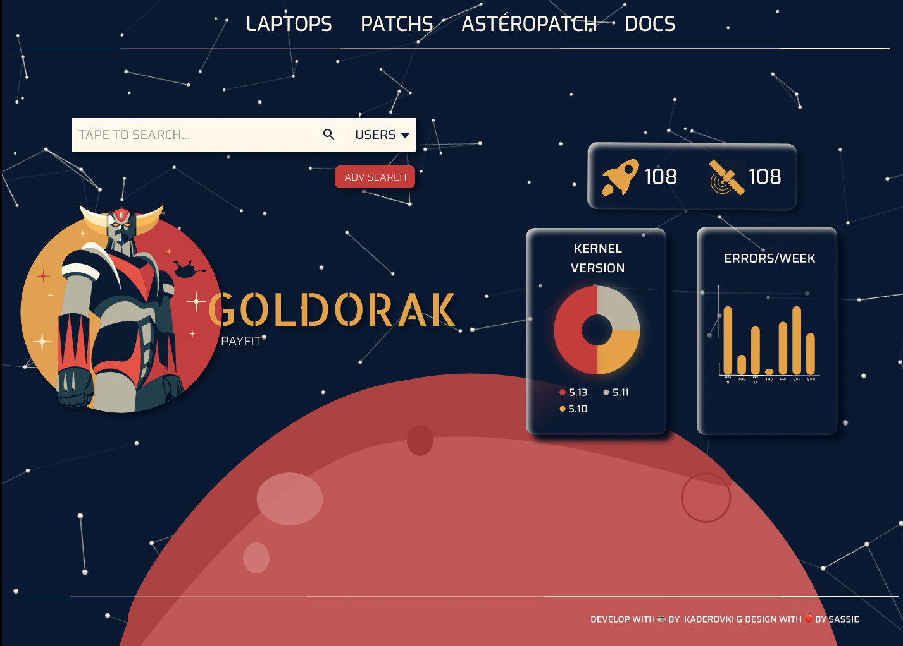
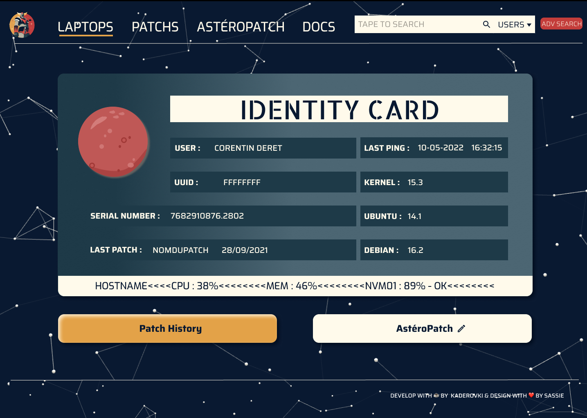
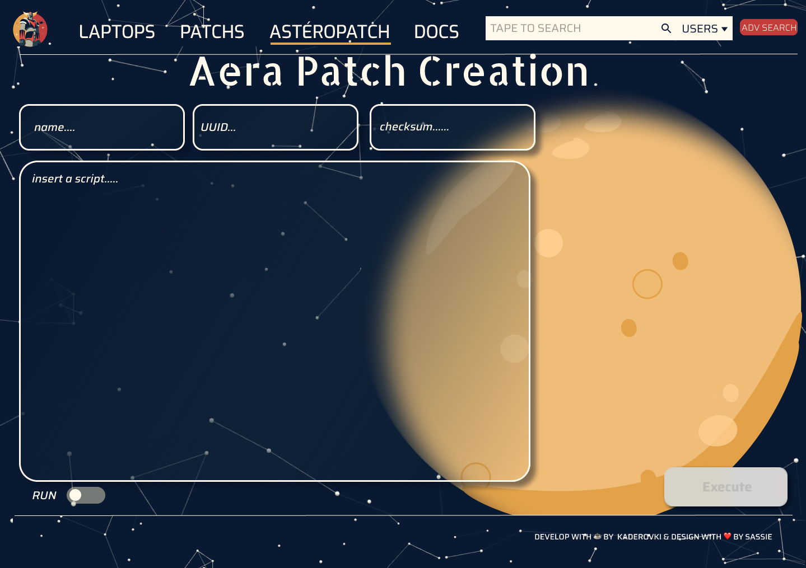
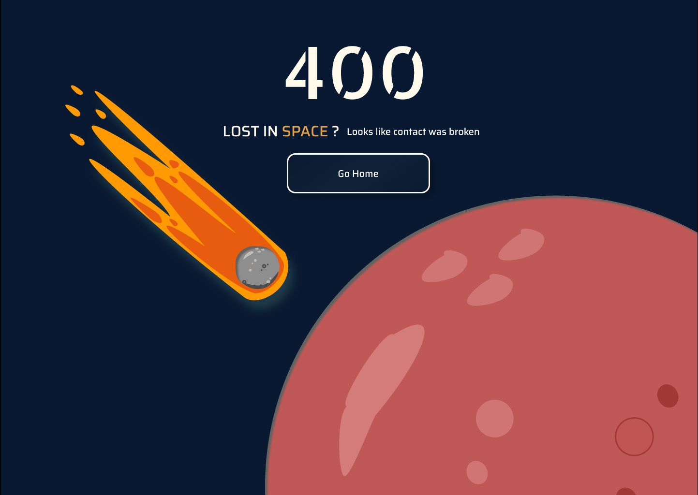

#### Project Requirements
<ul id='gold'>
<li> Full web integrated app </li>
<li> Responsive Design prototype </li>
<li> APIs binded actions </li>
<li> CRUD integration by click actions </li>
<li> Design identity </li>
<li> Complex knowledge on UNIX system</li>
</ul>

#### Project Details

Working on Goldorak was really fun! It took me back to childhood, I wanted this feeling on this project through my design product. Users are IT collaborators so they enjoyed this artistic decision ! Creating the planets was my favourite part. 

My challenge was to create an app that handles a whole complex IT system I wasn't familiar with.

Thank you again to trust me !

*Goldorak flat design illustration made by [Sedkialimam](https://dribbble.com/Sedkialimam)*

#### Preview

